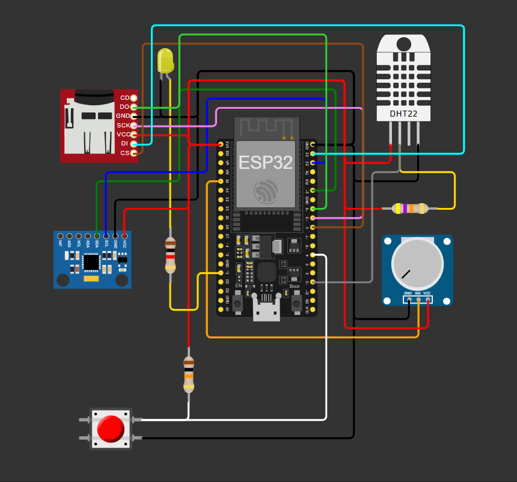
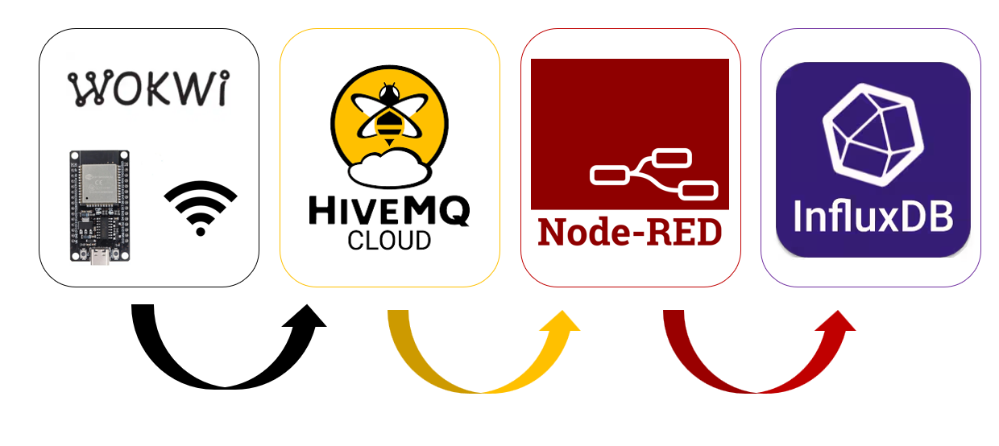
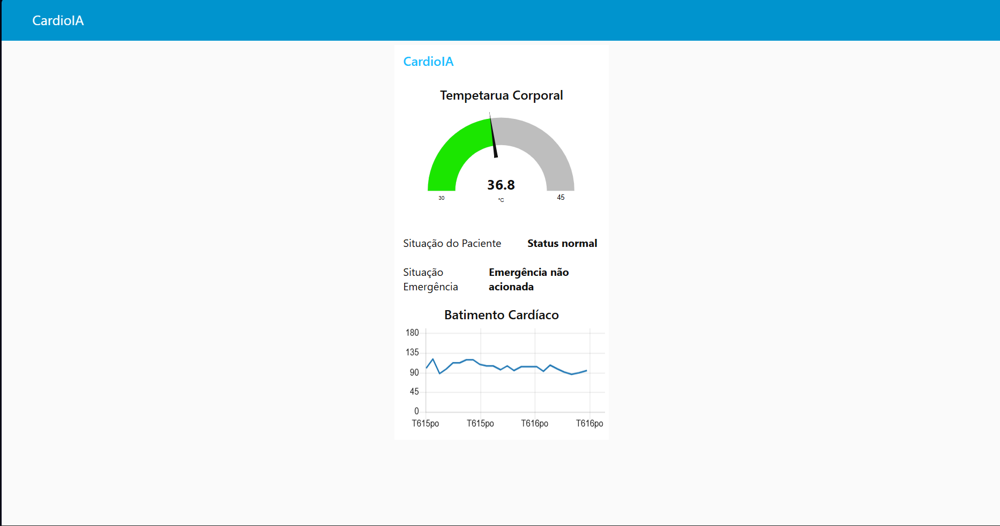

# FIAP - Faculdade de Informática e Administração Paulista

<p align="center">
<a href="https://www.fiap.com.br/">

</a>
</p>

<br>

# CardioIA — Sistema Vestível de Monitoramento Cardíaco

## Grupo São Paulo e Interior

## Integrantes

- <a href="https://www.linkedin.com/in/jonastadeufernandes">Jonas Tadeu V. Fernandes - RM563027</a>
- <a href="https://www.linkedin.com/">Levi Passos Silveira Marques - RM56557</a>
- <a href="https://www.linkedin.com/in/raphaelsilva-phael">Raphael da Silva - RM561452</a>
- <a href="https://www.linkedin.com/in/raphael-dinelli-8a01b278">Raphael Dinelli Neto - RM562892</a>
- <a href="https://www.linkedin.com/in/yan-cotta">Yan Pimental Cotta - RM562836</a>

## Professores

### Tutor

- <a href="https://www.linkedin.com/in/caique-nonato/">Caique Nonato da Silva Bezerra</a>

### Coordenador

- <a href="https://www.linkedin.com/in/andregodoichiovato">André Godoi</a>

---

## Descrição

O projeto CardioIA tem como objetivo simular um sistema vestível de monitoramento cardíaco, inspirado em dispositivos como smartwatches de saúde, integrando conceitos de Internet das Coisas (IoT), Edge Computing, Fog Computing e Cloud Computing.

## Parte 1 — Armazenamento e processamento local (Edge Computing)

Na Parte 1, o sistema foi desenvolvido com ESP32 no ambiente <a href="https://www.wokki.com">Wokwi</a>, realizando coleta e processamento local dos dados. Foram utilizados:

- Sensor DHT22 (temperatura e umidade)
- Sensor MPU6050 (movimento)
- Potenciômetro (simulação de batimentos cardíacos em BPM)
- Botão de emergência
- Cartão microSD para armazenamento local

Essa etapa priorizou a resiliência offline, com armazenamento em CSV e buffer em memória.

### Pré-requisitos

Para executar a Parte 1, recomenda-se utilizar:

Wokwi Web ou extensão Wokwi no VSCode;<br>
PlatformIO ou Arduino IDE;<br>
placa simulada ESP32;<br>
bibliotecas compatíveis com:<br>
DHT22;<br>
MPU6050;<br>
SD;<br>
SPI;<br>
Wire.<br>

### Componentes utilizados no circuito
- ESP32;
- DHT22;
- MPU6050;
- Potenciômetro;
- Botão de emergência;
- LED de alerta;
- Módulo microSD.




### Execução

1. Acesse o projeto no Wokwi ou abra a pasta [src/edge/esp32-edge](src/edge/esp32-edge). 
2. Verifique se os arquivos `main.ino`, `diagram.json` e `wokwi.toml` estão presentes.
3. Confira a pinagem dos sensores e do módulo microSD.
4. Execute a simulação.
5. Observe no Monitor Serial:
6. leituras de temperatura;
7. batimentos cardíacos simulados;
8. estado de movimento;
9. acionamento do botão de emergência;
10. armazenamento local em microSD;
11. fallback em RAM;
12. sincronização dos registros quando a conectividade simulada retornar.

---

## Parte 2 — Transmissão em Nuvem e Visualização (MQTT + Node-RED + InfluxDB)

Nesta etapa, o projeto evolui para uma arquitetura conectada à nuvem.

O fluxo implementado foi:


### Funcionalidades implementadas
- Envio de dados via MQTT com TLS (porta 8883)
- Estruturação de dados em JSON
- Recepção e tratamento no Node-RED
- Dashboard em tempo real com:
  - Gráfico de batimentos cardíacos (BPM)
  - Gauge de temperatura
  - Indicador de alerta
  - Indicador de emergência
- Armazenamento histórico no InfluxDB Cloud

Exemplo payload enviado
``` JSON
JSON

{
  "timestamp_ms": 38109,
  "temperature_c": 24.0,
  "humidity_percent": 40.0,
  "heart_rate_bpm": 60,
  "movement_detected": true,
  "emergency_pressed": false,
  "alert_active": false
}
```

### Como usar o sistema
Simulação:

- Ajustar potenciômetro → altera BPM
- Temperatura simulada pelo DHT22
- Pressionar botão → emergência

| Situação          | Resultado          |
| ----------------- | ------------------ |
| BPM > 120         | Alerta             |
| Temp > 38°C       | Alerta             |
| Botão pressionado | Emergência         |
| Movimento ausente | Pode indicar risco |



## Ir Além 1 — Comunicação automatizada com REST e e-mail

###  Objetivo

Ir Além 1 é simular um sistema de monitoramento inteligente que utiliza comunicação via API REST para envio de dados de sinais vitais e execução de lógica de detecção de risco em tempo real.

Essa etapa amplia o projeto CardioIA ao integrar conceitos de:

- Protocolo HTTP
- Arquitetura REST
- Manipulação de JSON
- Automação de processos (RPA)
- Sistemas de alerta em saúde digital

---

### Funcionamento

O sistema foi dividido em dois componentes principais:

#### API REST (Servidor)

Desenvolvida em **Python com Flask**, a API é responsável por:

- Receber dados de sinais vitais via requisição HTTP (POST)
- Validar os dados recebidos
- Aplicar regras de análise de risco
- Identificar eventos críticos
- Simular o envio de e-mail de alerta
- Registrar os eventos em arquivo JSON

---

#### Cliente Simulador

Um script em Python foi desenvolvido para simular o comportamento de um dispositivo ou usuário.

Esse cliente:

- Gera dados simulados de sinais vitais
- Simula cenário de risco (ex: taquicardia)
- Simula acionamento do botão de emergência
- Envia os dados para a API via requisição REST

---

### Lógica de Detecção de Risco

A API realiza análise com base nos seguintes critérios:

| Condição | Regra |
|--------|------|
| Taquicardia | Batimentos cardíacos > 120 bpm |
| Febre | Temperatura > 38 °C |
| Inatividade | Movimento não detectado |
| Emergência | Botão pressionado |

Se uma ou mais condições forem atendidas, o sistema:

- Classifica o nível de risco (normal, medium, high, critical)
- Gera um alerta
- Simula envio de e-mail
- Registra o evento

---

### Simulação de E-mail

O envio de e-mail foi implementado de forma simulada (sem SMTP real), com saída no terminal.

Exemplo de saída:

```text
text

[ALERTA CRÍTICO]
Paciente: patient_001
Batimentos: 132 bpm
Temperatura: 37.4 °C
Movimento: não detectado
Botão de emergência: pressionado
```

payload
```JSON
JSON

{
  "device_id": "cardioia_watch_001",
  "patient_id": "patient_001",
  "temperature_c": 37.4,
  "heart_rate_bpm": 132,
  "movement_detected": false,
  "emergency_button_pressed": true,
  "timestamp": "2026-04-26T10:30:00"
}
```

### Importância no Projeto

Essa etapa representa a integração entre:

- Camada embarcada (ESP32)
- Camada de processamento (Edge)
- Camada de comunicação (REST)
- Camada de automação (alertas)

Além disso, demonstra como sistemas de saúde digital podem:

- Detectar eventos críticos automaticamente
- Notificar responsáveis rapidamente
- Registrar histórico de eventos
- Operar de forma independente do hardware

## Ir além 2 — Inteligência Artificial em séries temporais de saúde

Em processo...
